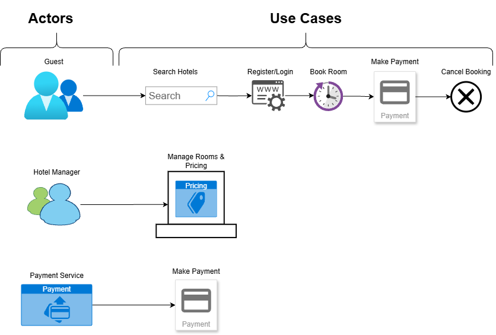

# requirement-analysis

This repository is dedicated to documenting and practising requirement analysis in software development.
It contains resources, exercises, and examples that help understand how to gather, analyse, and manage requirements effectively in real-world projects.

## What is Requirement Analysis?

Requirement Analysis is the process of understanding, gathering, and documenting what a software system should do. It is the foundation of the software development lifecycle (SDLC).

It involves working with stakeholders, end-users, and developers to clearly define functional requirements (what the system should do) and non-functional requirements (how the system should perform).

The importance of Requirement Analysis includes:
- Preventing misunderstandings between developers and clients.
- Reducing the risk of building the wrong product.
- Saving time and cost by identifying issues early.
- Providing a clear roadmap for design, development, and testing.

  Without proper requirement analysis, the software may fail to meet user needs or require costly changes later in the project.
  
## Why is Requirement Analysis Important?

Requirement Analysis is a crucial step in the Software Development Lifecycle (SDLC) because it ensures the project is built on a solid foundation. Its importance can be seen in the following areas:
1. **Clarity and Understanding**
   It creates a shared understanding between stakeholders and developers. Everyone agrees on what needs to be built, which reduces miscommunication.
2. **Cost and Time Efficiency**
   Identifying and fixing problems during the analysis phase is cheaper and faster compared to fixing them later during development or testing.
3. **Quality Assurance**
   Well-defined requirements provide a benchmark for testing. The development team knows exactly what to deliver, which increases the chances of producing a high-quality product.
4. **Project Success**
   Projects that start with clear requirements are more likely to meet user needs and business goals, increasing the overall success rate.
   
## Key Activities in Requirement Analysis

Requirement Analysis involves several activities that help ensure the system meets user and business needs. The five key activities are:

- **Requirements Gathering**
  Collecting initial information from stakeholders about what the system should do.
  
- **Requirement Elisitation**
  Engaging stakeholders through interviews, surveys, and workshops to uncover detailed needs and expectations.
  
- **Requirement Documentation**
  Recording requirements in a structured format, such as Software Requirements Specifications (SRS).

- **Requirement Analysis and Modelling**
  Analysing requirements to resolve conflicts, prioritise features, and create models (like use cases or diagrams) to visualise the system.

- **Requirement Validation**
  Reviewing requirements with stakeholders to ensure they are accurate, complete, and aligned with business goals.
  
## Types of Requirements

In software development, requirements are usually divided into two categories: Functional and Non-functional. Both are important for building a successful system.

### Eunctional Requirements
Functional requirements describe what the system should do. They are features or functions that the application must provide to meet user needs.

**Examples for a Hotel Booking System:**
- Users should be able to search for hotels by location and date.
- The system should allow users to create an account and log in.
- The booking service should let customers reserve rooms and make payments.
- Hotel managers should be able to update room availability and pricing.

### Non-functional Requirements
Non-functional requirements describe how the system should perform. They define quality attributes, performance, and constraints rather than specific behaviours.

**Examples for a Hotel Booking System:**
- The system should respond to users' searches within 2 seconds.
- The platform should support at least 10,000 concurrent users.
- User data should be encrypted to ensure security.
- The application should be available 99.9% of the time (high availability).

## Use Case Diagrams

A Use Case Diagram is a visual representation of how users (actors) interact with the system. It shows the relationships between actors and the system's use cases.

**Benefits of Use Case Diagram:**
- Provide a high-level view of system functionality.
- Help stakeholders understand how users interact with the system.
- Serve as a bridge between business requirements and system design.

### Hotel Booking System Example

Below is a sample use case diagram for a hotel booking system.

## Acceptance Criteria

### Importance of Acceptance Criteria
- Acceptance criteria define the conditions a feature must meet to be considered complete.  
- They align developers, testers, and stakeholders on what is expected.  
- They reduce ambiguity by making requirements testable and measurable.  
- They serve as the basis for test cases during Quality Assurance.

### Example: Checkout Feature in the Booking Management System
**Acceptance Criteria:**
- The system must allow users to view their booking summary before payment.  
- The system must support at least two payment methods (e.g., credit card, mobile money).  
- The system must display a confirmation message after successful payment.  
- The system must send an email receipt to the user after checkout.  
- If payment fails, the system must allow the user to retry or choose another payment option.  
